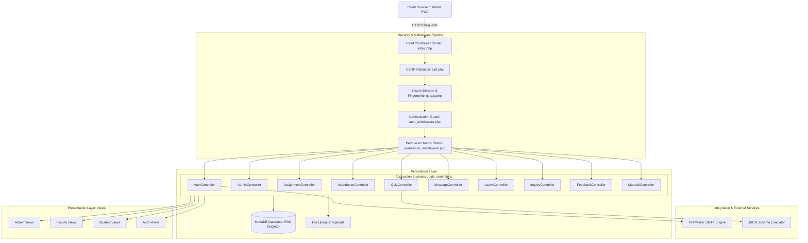
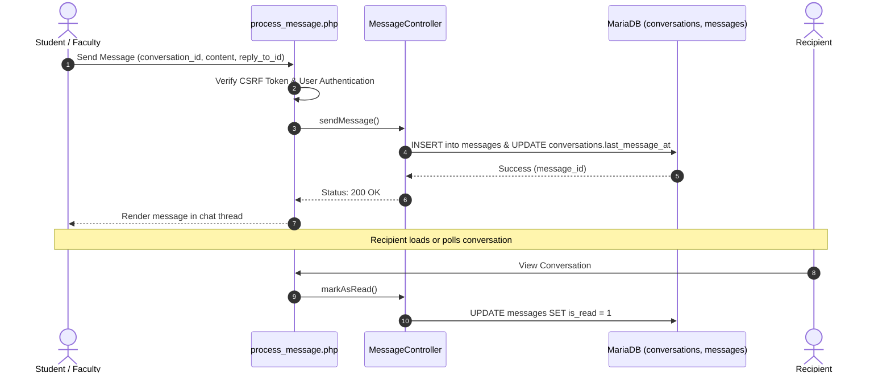
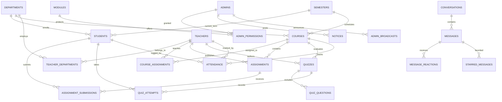

# GreenField College CMS (GFC CMS)
### *Next-Generation Enterprise College Management System & Academic ERP*

---

[](https://www.php.net/)
[](https://mariadb.org/)
[](https://tailwindcss.com/)
[](#-security--integrity-framework)
[](#-pwa--offline-capabilities)
[](LICENSE)

---

## 📑 Table of Contents

- [1. Executive Overview](#1-executive-overview)
- [2. System Architecture](#2-system-architecture)
- [3. Technology Stack](#3-technology-stack)
- [4. Role-Based Portals & Functional Modules](#4-role-based-portals--functional-modules)
  - [4.1 Administrative Portal & RBAC Matrix](#41-administrative-portal--rbac-matrix)
  - [4.2 Faculty Portal & Modern Faculty Dashboard](#42-faculty-portal--modern-faculty-dashboard)
  - [4.3 Student Portal & Modern Academic Dashboard](#43-student-portal--modern-academic-dashboard)
  - [4.4 Public & Prospective Student Features](#44-public--prospective-student-features)
- [5. Advanced Communication & Messaging Engine](#5-advanced-communication--messaging-engine)
- [6. Security & Integrity Framework](#6-security--integrity-framework)
- [7. Database Schema & Data Modeling](#7-database-schema--data-modeling)
- [8. Repository Directory Structure](#8-repository-directory-structure)
- [9. Setup & Installation Guide](#9-setup--installation-guide)
- [10. Authentication & Seed Data](#10-authentication--seed-data)
- [11. PWA & Offline Capabilities](#11-pwa--offline-capabilities)
- [12. Production Hardening & Best Practices](#12-production-hardening--best-practices)
- [13. License & Attribution](#13-license--attribution)

---

## 1. Executive Overview

**GreenField College CMS (GFC CMS)** is an end-to-end, multi-tier College Management System and Academic ERP engineered to modernize administrative, educational, and operational workflows for higher education institutions.

The application eliminates administrative friction by interconnecting four core institutional stakeholders: **Super Administrators / Sub-Admins**, **Faculty Members**, **Enrolled Students**, and **Prospective Applicants**. From student admission inquiries and department course structuring to real-time messaging, attendance tracking, timed online examinations, and dynamic grade books, GFC CMS delivers a unified, performant, and secure platform.

---

## 2. System Architecture

GFC CMS is designed around a modern **Model-View-Controller (MVC) influenced architecture** built with PHP and MariaDB, incorporating strict Object-Oriented design principles, automated request routing, and defense-in-depth security layers.

### 🏛️ High-Level System Architecture Diagram



### Architectural Tenets:
1. **Singleton PDO Connection:** Database connections are managed via `\Config\Database::getInstance()`, eliminating redundant TCP socket overhead and guaranteeing query consistency.
2. **Prepared Statements Exclusively:** Emulated prepares are disabled (`PDO::ATTR_EMULATE_PREPARES => false`) to enforce server-side parameterized queries and prevent SQL Injection.
3. **Granular RBAC Module Engine:** Sub-admins are evaluated dynamically against permission tables on every route transition via `require_permission()`.
4. **Decoupled Asynchronous Messaging:** Direct peer messaging, faculty-student channels, emoji reactions, and broadcasts operate with sub-second response times using optimized indexing.

---

## 3. Technology Stack

| Layer | Technologies & Dependencies | Purpose |
| :--- | :--- | :--- |
| **Backend Runtime** | **PHP 8.0+** (Strict typing enabled) | Core application routing, authentication, business logic |
| **Database** | **MariaDB 10.4+ / MySQL 8.0+** (InnoDB Engine) | Relational persistence, JSON-enabled schemas, ACID compliance |
| **Database Abstraction** | **PHP Data Objects (PDO)** | Secure parameterized abstraction layer |
| **Frontend Framework** | **HTML5, TailwindCSS, Vanilla JS** | Modern, responsive, utility-driven UI with Dark/Light theme mode |
| **Typography & Icons** | **Google Fonts (Inter)**, **Lucide Icons** | High-density interface iconography and accessible typography |
| **Data Visualization** | **Chart.js** | Interactive graphical attendance, admissions, and grade distribution charts |
| **Document Processing** | **SheetJS (XLSX)**, **html2pdf.js** | Client-side export of student lists, rosters, and transcripts to Excel & PDF |
| **Alerts & Modals** | **SweetAlert2** | Interactive toast notifications and operational confirmation modals |
| **Email Protocol** | **PHPMailer (SMTP over TLS)** | Automated dispatch of 6-digit OTP codes for password recovery |
| **PWA Infrastructure** | **Service Workers (`sw.js`)**, **Web Manifest** | Offline asset caching, installable mobile app experience |

---

## 4. Role-Based Portals & Functional Modules

---

### 4.1 Administrative Portal & RBAC Matrix
The Admin Portal provides institutional leadership and administrative personnel with comprehensive management over college operations.

```
/views/admin/
├── dashboard.php               # Analytical summary metrics & activity graphs
├── manage-admins.php           # Sub-admin delegation & permission assignment
├── students.php                # Student registry, enrollments, credentials
├── faculty.php                 # Faculty directory & department assignments
├── departments.php             # Academic department architecture
├── semesters.php               # Semester schedules and academic sessions
├── subjects.php                # Course catalog and credit values
├── subject_assignments.php     # Faculty-to-Course allocations
├── timetables.php              # Institutional master schedule builder
├── broadcasts.php              # Global, role-filtered, or targeted announcements
├── notices.php                 # Official college noticeboard manager
├── leave_requests.php          # Approval/rejection workflow for faculty & student leaves
├── admission-inquiries.php     # Prospective student inquiry CRM
├── view-feedback.php           # Feedback moderation & institutional rating reviews
└── security_logs.php           # Real-time authentication security audit logs
```

#### Key Capabilities:
- **Sub-Admin Delegation (Module Permissions):** The Super Admin can create secondary admin accounts and assign granular read/write rights across 15+ modules (`students`, `faculty`, `broadcasts`, `notices`, `security_logs`, etc.). Sub-admins without adequate permissions are immediately blocked via `permission_middleware.php`.
- **Master Timetable Generator:** Schedules classes by department, semester, subject, instructor, weekday, and classroom room number.
- **Institutional Broadcast Engine:** Broadcast critical messages with priorities (`NORMAL`, `URGENT`, `ACADEMIC`, `EVENT`), target filtering (`ALL`, `STUDENT`, `FACULTY`), and sticky pinning.
- **Security Audit Matrix:** Logs all login attempts, capturing IP addresses, browser user-agent vectors, outcome (`GRANTED` / `BLOCKED`), and timestamps.

---

### 4.2 Faculty Portal & Modern Faculty Dashboard
The Faculty Portal provides educators with an intuitive digital workstation to manage courses, students, attendance, instructional materials, and examinations.

```
/views/faculty/
├── dashboard.php               # Modernized workstation dashboard with KPI metrics & Chart.js analytics
├── my_subjects.php             # Allocated subjects & course syllabus
├── my_students.php             # Student roster for assigned courses
├── take_attendance.php         # Quick multi-student attendance marking
├── view_attendance.php         # Historical attendance registries & export
├── assignments.php             # Coursework assignment creator & file attachments
├── view_submissions.php        # Student submission grading, grading notes & status
├── quizzes.php                 # Online examination & quiz builder
├── manage_quiz.php             # Question bank creation, point weighting & duration
├── quiz_results.php            # Automated attempt scores & submission breakdown
├── study_materials.php         # Digital file repository for lecture notes & PDFs
├── messages.php                # Real-time chat with students & faculty peers
├── apply_leave.php             # Leave applications with file uploads
└── timetable.php               # Personalized weekly teaching schedule
```

#### 🌟 Modern Faculty Workstation Dashboard Highlights (`dashboard.php`):
- **Executive Faculty Welcome Hero:** Time-aware dynamic greeting (`Good Morning / Afternoon / Evening`), faculty designation, department code, qualification badge, live date display, and active duty indicator.
- **Contextual Submission Evaluation Alert:** Real-time banner highlighting pending student submissions awaiting review and grading.
- **Faculty Operations Hub (6-Tile Action Matrix):** 1-click workflows for *Mark Attendance*, *Assignments Portal*, *Study Notes*, *Online Quizzes*, *Manage Marks*, and *Apply Leave* with micro-hover scaling and gradient icon containers.
- **Key Performance Metrics (6 KPI Grid Cards):**
  1. **Assigned Courses:** Active courses count with deep link to course syllabus.
  2. **Total Students:** Enrolled active students roster count.
  3. **Class Attendance Rate:** Overall presence rate (%) across sessions with attendance logs matrix link.
  4. **Assignments & Submissions:** Total created tasks with pending review counter.
  5. **Study Materials & Storage:** Total documents published with aggregate storage size in megabytes.
  6. **Online Quizzes & Attempts:** Published quiz evaluations and student attempt volume.
- **Dual Interactive Visual Analytics (Chart.js):**
  - *Coursework & Assignments by Subject:* Vertical bar chart with linear canvas gradients, rounded bar geometry, and custom tooltips.
  - *Study Materials Distribution:* Multi-segment doughnut chart with custom center text metric plugin showing total materials and percentage breakdowns.
  - *Multi-Format Chart Export:* Client-side export dropdown enabling instant download to **PDF** (`html2pdf.js`) and **Excel** (`SheetJS XLSX`).
- **Live Class Schedule (Timetable Tracker):** Today's lectures list with room number, start/end time chips, and 1-click "Take Attendance" shortcut.
- **Campus Circulars & Administrative Notices:** Official announcements with pinned badges, publication dates, and author attribution.
- **Coursework Deliverables & Resources:** Recently created assignments with submission counters and recent study material uploads with 1-click download actions.

#### Key Capabilities:
- **Attendance Management:** Mark attendance daily with single-click status toggles (`PRESENT`, `ABSENT`, `LATE`) and instant attendance percentage computations.
- **Assessment & Grading Suite:** Create assignments with strict deadlines and late-submission flags. Review uploaded student files, assign scores, and issue qualitative feedback.
- **Online Quiz Engine:** Build timed quizzes with auto-scoring multiple-choice questions, shuffle logic, answer explanations, and automated grade posting.
- **Course Material Distribution:** Upload syllabi, presentation decks, and supplementary materials with controlled student download permissions.

---

### 4.3 Student Portal & Modern Academic Dashboard
The Student Portal empowers learners with self-service academic tracking, lecture materials, and communication channels.

```
/views/student/
├── dashboard.php               # Modernized academic control center with attendance intelligence & Chart.js analytics
├── my_subjects.php             # Enrolled courses, instructors, credit hours
├── my_attendance.php           # Subject-wise attendance percentages & status log
├── my_timetable.php            # Visual weekly class schedule & room assignments
├── my_grades.php               # Comprehensive grade book, assignment & quiz marks
├── assignments.php             # Active assignments, deadlines & upload submission
├── quizzes.php                 # Active & upcoming online examinations
├── take_quiz.php               # Interactive timed quiz-taking interface
├── quiz_result.php             # Post-exam question breakdown and score report
├── study_materials.php         # Download center for teacher-published resources
├── messages.php                # Direct messaging with professors and classmates
├── apply_leave.php             # Student leave application submission
└── notices.php                 # Institutional circulars & pinned notices
```

#### 🌟 Modern Student Academic Dashboard Highlights (`dashboard.php`):
- **Student Academic Passport & Welcome Hero:** Personalized time-aware greeting, student avatar with active status pulse, Department Name & Code badge, Current Semester indicator, Roll Number, Registration Number, Academic Year, and total registered credits (`credits` sum).
- **Contextual Attendance Advisory Engine:**
  - Real-time evaluation against the mandatory **75% examination eligibility threshold**.
  - *Attendance Below 75%:* Computes and warns the exact number of consecutive classes needed to attend without absence to regain examination eligibility.
  - *Attendance Safe (≥75%):* Displays congratulations and computes the safe margin of classes that can be missed without dropping below 75%.
- **Official Campus Broadcast Alert:** Urgent administrative announcements (`admin_broadcasts`) with priority indicators.
- **Student Operations Hub (6-Tile Action Matrix):** 1-click quick launch to *Class Schedule*, *Assignments Portal* (with pending tasks counter), *Study Notes*, *Online Quizzes* (with available count), *Marks & Grades*, and *Apply Leave*.
- **Key Academic Metrics (6 KPI Grid Cards):**
  1. **Enrolled Courses:** Enrolled course count and total registered credits.
  2. **Attendance Rate:** Overall percentage with color-coded safety badges (Green ≥75%, Amber 50-74%, Rose <50%) and attended/total ratio.
  3. **Assignments:** Pending tasks requiring submission vs total submitted.
  4. **Online Quizzes:** Active tests available to take vs completed attempts.
  5. **Study Materials:** Downloadable lecture notes, slides, and syllabus files.
  6. **Today's Classes:** Lecture count scheduled for the current day.
- **Dual Interactive Visual Analytics (Chart.js):**
  - *Subject Attendance Breakdown Bar Chart:* Course-by-course attendance rates with safe/warning threshold coloring and detailed tooltips (Present, Late, Absent, Total).
  - *Academic Scores Performance Bar Chart:* Score percentage distribution across assessments, internal tests, and coursework.
  - *Multi-Format Chart Export:* Client-side export dropdown enabling instant download to **PDF** (`html2pdf.js`) and **Excel** (`SheetJS XLSX`).
- **Live Today's Lecture Tracker:** Chronological lecture timeline with course code, room number, instructor name, time slots, and an animated real-time `"NOW"` status badge for ongoing lectures.
- **Upcoming Tasks & Recent Grades Hub:**
  - *Upcoming Deliverables:* Pending assignments with due dates and overdue warning badges + 1-click "Submit"; available quizzes with question counts, time durations, and "Start Quiz" CTAs.
  - *Recent Grades & Feedback:* Published scores with percentage badges, marks obtained vs max marks, and teacher qualitative remarks.
- **Recent Study Materials Download Hub:** Responsive 4-card grid highlighting newly uploaded syllabus files, lecture notes, and reference books with file format badges (PDF, DOC, PPT) and 1-click direct download.
- **Zero-Flicker Theme Synchronization:** Fully integrated with dark/light mode toggle via `MutationObserver` to re-render charts automatically on theme switch.

#### Key Capabilities:
- **Real-Time Attendance Monitoring:** Live visual alerts when attendance drops near institutional thresholds, with exact compensatory class calculations.
- **Assessment Submission:** Submit assignments with automatic late-submission detection (`is_late`), file validation, and revision history.
- **Interactive Quiz Engine:** Fully timed online quiz player with local counter protection, automated submission on timeout, and post-exam review.
- **Peer & Faculty Messaging:** Discuss doubts with subject teachers or collaborate with peers in the same batch.

---

### 4.4 Public & Prospective Student Features
- **Admission Inquiries:** Prospective students can submit admission inquiries via the public landing page, detailing their target program, past qualifications, and questions.
- **Public Feedback:** Visitors and alumni can leave institutional feedback across categorized themes with 1–5 star ratings.
- **Public Noticeboard:** Urgent campus announcements and admissions notices are accessible directly from the landing page.

---

## 5. Advanced Communication & Messaging Engine

The messaging architecture in GFC CMS (`MessageController.php` & `process_message.php`) provides modern conversational capabilities directly within the portal:



### Messaging Highlights:
- **Multi-Role Conversational Routing:** Supports **Faculty-to-Student**, **Student-to-Student (Peer)**, and **Faculty-to-Faculty** dialogues.
- **Message Reactions:** Real-time emoji reactions (`👍`, `❤️`, `💡`, `❓`, `✅`) logged in `message_reactions`.
- **Starred Messages:** Bookmark critical instructions or notes into an indexed personal collection (`starred_messages`).
- **Quote & Reply:** Threaded replies with clickable references to original messages (`reply_to_id`).
- **Unsend / Message Recall:** Senders can unsend messages within permissible windows, updating flags without breaking thread integrity.
- **Independent Thread Clearing:** Users can clear their chat history (`student_cleared_at`, `faculty_cleared_at`) without removing messages from the other participant's history.

---

## 6. Security & Integrity Framework

GFC CMS incorporates enterprise-level defensive engineering to safeguard sensitive institutional records:

```
                               ┌────────────────────────┐
                               │ Incoming HTTP Request  │
                               └───────────┬────────────┘
                                           │
                     ┌─────────────────────▼─────────────────────┐
                     │ CSRF Shield: verify_csrf_token()          │
                     │ (Cryptographic hash_equals comparison)    │
                     └─────────────────────┬─────────────────────┘
                                           │
                     ┌─────────────────────▼─────────────────────┐
                     │ Session Integrity: Cookie Flags           │
                     │ (HttpOnly=1, SameSite=Strict, Lifetime)   │
                     └─────────────────────┬─────────────────────┘
                                           │
                     ┌─────────────────────▼─────────────────────┐
                     │ Authentication Guard: require_auth()      │
                     └─────────────────────┬─────────────────────┘
                                           │
                     ┌─────────────────────▼─────────────────────┐
                     │ RBAC Gatekeeper: require_permission()     │
                     │ (Evaluates role against module keys)      │
                     └─────────────────────┬─────────────────────┘
                                           │
                     ┌─────────────────────▼─────────────────────┐
                     │ Parameterized Execution: PDO Prepared     │
                     │ Statements (Emulate prepares = false)     │
                     └───────────────────────────────────────────┘
```

1. **CSRF Mitigation:** Every state-modifying `POST` form requires a cryptographic token (`csrf_field()`), validated using timing-attack resistant `hash_equals()`.
2. **Password Cryptography:** User authentication employs modern password hashing algorithms:
   - **Argon2id** (`PASSWORD_ARGON2ID`) for students and faculty.
   - **Bcrypt** (`PASSWORD_BCRYPT`, Cost: 10) for administrators.
3. **Session Hardening:** Configured in `config/app.php`:
   - `session.cookie_httponly = 1`: Neutralizes XSS session theft.
   - `session.cookie_samesite = Strict`: Prevents Cross-Site Request Forgery via third-party contexts.
   - 24-hour strict session lifetime (`SESSION_LIFETIME = 86400`).
4. **Audit Trail & Threat Telemetry:** The `security_logs` subsystem records every authentication attempt:
   - User table and submitted identifier.
   - Status: `GRANTED` or `BLOCKED`.
   - Client IP Address and User-Agent Browser Vector.
5. **Secure OTP Password Recovery:** Forgot-password workflows generate a cryptographically randomized 4-to-6 digit OTP, valid for exactly 10 minutes, dispatched via encrypted TLS SMTP through PHPMailer.

---

## 7. Database Schema & Data Modeling

The relational database (`college_cms`) comprises 22 synchronized tables designed with foreign key constraints and cascading rules.

### Entity Relationship Map



### Table Dictionary:
| Table Name | Primary Purpose | Key Foreign Keys & Constraints |
| :--- | :--- | :--- |
| `admins` | Super Admin & Sub-Admin accounts and roles | Primary Key (`id`), Unique (`email`) |
| `admin_permissions`| RBAC junction linking admins to permitted modules | FK `admins(id)`, FK `modules(id)` |
| `modules` | Registered system modules with icon & route info | Unique (`module_key`) |
| `teachers` | Faculty instructor accounts, qualifications, profiles | Primary Key (`id`), Unique (`email`) |
| `teacher_departments`| Junction associating faculty members with departments | FK `teachers(id)`, FK `departments(id)` |
| `students` | Enrolled student profiles, roll numbers, semesters | FK `departments(id)`, FK `semesters(id)` |
| `departments` | Academic divisions (CS, BCA, BBA, EE, etc.) | Primary Key (`id`), Unique (`dept_code`) |
| `semesters` | Academic terms and status tracking | Unique (`semester_number`, `academic_year`) |
| `courses` | Subject catalog, credit points, syllabus links | FK `departments(id)`, FK `semesters(id)` |
| `course_assignments`| Mapping instructors to taught subjects | FK `courses(id)`, FK `teachers(id)` |
| `timetables` | Weekly scheduling matrix by day, time, room | FK `courses(id)`, FK `teachers(id)`, FK `departments(id)` |
| `assignments` | Coursework assignments created by instructors | FK `courses(id)`, FK `teachers(id)` |
| `assignment_submissions`| Student uploaded work, scores, and feedback | FK `assignments(id)`, FK `students(id)` |
| `quizzes` | Timed online examinations and configurations | FK `courses(id)`, FK `teachers(id)` |
| `quiz_questions`| Question bank items (Options A–D, correct answer) | FK `quizzes(id)` |
| `quiz_attempts` | Student exam attempts, scores, and JSON answers | FK `quizzes(id)`, FK `students(id)` |
| `study_materials` | Digital educational PDFs, slides, and docs | FK `courses(id)`, FK `teachers(id)` |
| `attendance` | Daily attendance tracking records | FK `students(id)`, FK `courses(id)`, FK `teachers(id)` |
| `conversations` | Messaging channels (peer, faculty-student) | Unique participant pairs |
| `messages` | Chat entries, quote replies, pins, unsend flags | FK `conversations(id)`, Self FK `reply_to_id` |
| `message_reactions`| Message emoji reactions | FK `messages(id)` |
| `starred_messages` | User-favorited bookmarked chat messages | FK `messages(id)` |
| `admin_broadcasts` | High-priority announcements and broadcast alerts | FK `admins(id)` |
| `notices` | Official institutional notices and circulars | FK `admins(id)` |
| `leave_requests` | Faculty and student leave applications | Applicant polymorphic keys |
| `admission_inquiries`| Inquiries from prospective applicants | FK `departments(id)` |
| `feedbacks` | Feedback and ratings from students, faculty, guests | Indexed by role & status |
| `security_logs` | Authentication attempt audit logs | Indexed by status & timestamp |

---

## 8. Repository Directory Structure

```
college_cms/
├── assets/                          # Static Frontend Distribution Assets
│   ├── css/
│   │   └── tailwind.css             # Tailwind baseline stylesheet
│   ├── images/                      # System brand assets and logos
│   └── js/
│       ├── attendance.js            # Client-side attendance toggles
│       ├── charts.js                # Chart.js initialization, export utilities, faculty & student analytics
│       └── main.js                  # Global UI behaviors & notifications
├── config/                          # System Configuration & Bootstrapping
│   ├── app.php                      # Application constants, error handling, session hardening
│   └── database.php                 # Singleton PDO database connector
├── controllers/                     # Application Business Logic Controllers
│   ├── AdminController.php          # Admin dashboard & analytics logic
│   ├── AssessmentController.php     # Manual assessment scoring logic
│   ├── AssignmentController.php     # Coursework management & grading
│   ├── AttendanceController.php     # Daily attendance calculation & recording
│   ├── AuthController.php           # Authentication, session establishment, OTP mailer
│   ├── FeedbackController.php       # Feedback ingestion & admin moderation
│   ├── InquiryController.php        # Prospective student admissions inquiry pipeline
│   ├── LeaveController.php          # Faculty & student leave workflows
│   ├── MaterialController.php       # File repository uploading & streaming
│   ├── MessageController.php        # Messaging, reactions, replies, pinning
│   ├── NoticeController.php         # Official college circular publishing
│   ├── QuizController.php           # Online test generation & auto-grading
│   └── process_*.php                # Action dispatcher endpoint handlers
├── includes/                        # System Middlewares, Core Helpers, Libraries
│   ├── PHPMailer/                   # PHPMailer SMTP email engine
│   ├── auth_middleware.php          # Session verification (`require_auth`, `require_role`)
│   ├── csrf.php                     # CSRF token generation and validation helpers
│   ├── footer.php                   # Portal standard footer & JS inclusions
│   ├── header.php                   # HTML5 head, Tailwind CDN, Lucide icons, Dark theme
│   ├── helpers.php                  # Global helpers (`sanitize`, `redirect`, `flash`)
│   ├── main_footer.php              # Public landing page footer
│   ├── permission_middleware.php    # Granular RBAC validation (`require_permission`)
│   └── sidebar.php                  # Dynamic role & module-filtered navigation sidebar
├── uploads/                         # Secure Storage for User-Uploaded Files
│   ├── assignments/                 # Student-submitted coursework
│   ├── materials/                   # Faculty lecture notes and presentations
│   └── profiles/                    # User profile avatars
├── views/                           # Presentation Layer (Organized by Portal)
│   ├── admin/                       # 50+ administrative management pages
│   ├── auth/                        # Role-specific login pages, OTP, password reset
│   ├── faculty/                     # Next-gen faculty workstation dashboard, attendance, grading, quizzes
│   └── student/                     # Next-gen student academic dashboard, grades, quizzes, materials
├── database.sql                     # Complete MariaDB database dump with seed data
├── index.php                        # Application entry point, router & public landing page
├── manifest.json                    # Progressive Web App manifest configuration
├── sw.js                            # Service Worker for offline asset caching
└── README.md                        # Official System Technical Documentation
```

---

## 9. Setup & Installation Guide

### 📋 Prerequisites
- **Web Server:** Apache (with `mod_rewrite` enabled) or Nginx.
- **PHP Environment:** PHP 8.0 or newer.
- **Database Engine:** MariaDB 10.4+ or MySQL 8.0+.
- **PHP Extensions Required:** `pdo`, `pdo_mysql`, `openssl`, `mbstring`, `json`, `session`.
- **Recommended Stack:** XAMPP, WAMP, Laragon, or a native Linux LAMP stack.

---

### 🚀 Step-by-Step Installation

#### Step 1: Clone or Place the Repository
Clone or extract the repository directly into your web server's document root:
- **XAMPP (Windows):** `C:\xampp\htdocs\college_cms`
- **Linux (Apache):** `/var/www/html/college_cms`

```bash
git clone https://github.com/<your-username>/college_cms.git
```

#### Step 2: Database Creation & Migration
1. Launch the MariaDB/MySQL service through the XAMPP Control Panel or terminal.
2. Create a new database named `college_cms`:
   ```sql
   CREATE DATABASE college_cms CHARACTER SET utf8mb4 COLLATE utf8mb4_unicode_ci;
   ```
3. Import the pre-configured schema and seed data from `database.sql`:
   ```bash
   mysql -u root -p college_cms < database.sql
   ```
   *(Alternatively, use phpMyAdmin -> Import -> select `database.sql`)*.

#### Step 3: Application Configuration
Open `config/database.php` and verify or adjust your database credentials:
```php
private string $host = 'localhost';
private string $db_name = 'college_cms';
private string $username = 'root'; // Your DB username
private string $password = '';     // Your DB password
```

Open `config/app.php` and confirm your base application URL:
```php
define('BASE_URL', '/college_cms'); // Match your web directory path
```

#### Step 4: Storage Directory Permissions
Ensure that the `uploads/` directory and its subdirectories are writable by the web server process:
```bash
# On Linux / macOS
chmod -R 775 uploads/
chown -R www-data:www-data uploads/
```

#### Step 5: Email (SMTP) Configuration for Password Resets
If utilizing the OTP-based password reset module, configure your SMTP server parameters in `controllers/AuthController.php` (around line 178):
```php
$mail->isSMTP();
$mail->Host       = 'smtp.gmail.com';
$mail->SMTPAuth   = true;
$mail->Username   = 'your-institution-email@gmail.com'; 
$mail->Password   = 'your-app-specific-password'; 
$mail->SMTPSecure = \PHPMailer\PHPMailer\PHPMailer::ENCRYPTION_STARTTLS;
$mail->Port       = 587;
```

#### Step 6: Launch & Verify
Open your browser and navigate to:
```
http://localhost/college_cms
```

---

## 10. Authentication & Seed Data

The database dump includes pre-configured demo accounts for all three user portals:

| Portal | Role | Email Address | Default Password | Notes |
| :--- | :--- | :--- | :--- | :--- |
| **Admin Portal** | `SUPER ADMIN` | `admin@college.edu` | *(Use Reset or see below)* | Unrestricted wildcard access (`*`) to all modules |
| **Faculty Portal** | `FACULTY` | `faculty1@gmail.com` | *(Use Reset or see below)* | Assigned to BCA & CS Departments |
| **Faculty Portal** | `FACULTY` | `faculty2@gmail.com` | *(Use Reset or see below)* | Assigned to BCA & BBA Departments |
| **Student Portal** | `STUDENT` | `ankanbiswas7699@gmail.com` | *(Use Reset or see below)* | BCA Semester 1 |
| **Student Portal** | `STUDENT` | `happy@gmail.com` | *(Use Reset or see below)* | BCA Semester 1 |

> [!TIP]
> **Password Recovery in Local Development:**
> To reset any account password locally, navigate to `http://localhost/college_cms/views/auth/forgot-password.php`, enter the account email, and follow the OTP verification workflow. Alternatively, update the hash directly in SQL using `password_hash('your_new_password', PASSWORD_BCRYPT)` for admins or `PASSWORD_ARGON2ID` for teachers/students.

---

## 11. PWA & Offline Capabilities

GFC CMS includes native Progressive Web App (PWA) support, enabling mobile and tablet users to install the system like an application.

- **Manifest Configuration (`manifest.json`):** Defines the application name, theme color (`#4f46e5`), standalone display mode, and responsive launcher icons.
- **Service Worker (`sw.js`):** Intercepts network calls to provide offline caching for core assets, including Tailwind styles, fonts, and Lucide icons.
- **Cross-Platform Compatibility:** Fully optimized for desktop browsers, iPads, and Android/iOS smartphones.

---

## 12. Production Hardening & Best Practices

Before deploying GFC CMS to a production environment, complete the following hardening steps:

1. **Enforce HTTPS & Secure Cookies:**
   In `config/app.php`, uncomment the secure cookie directive:
   ```php
   ini_set('session.cookie_secure', '1');
   ```
2. **Disable Public Error Display:**
   Disable on-screen error rendering in production to prevent leaking sensitive paths or configurations:
   ```php
   ini_set('display_errors', '0');
   ini_set('display_startup_errors', '0');
   error_reporting(E_ALL); // Logged to web server error log
   ```
3. **Restrict Direct Directory Browsing:**
   Ensure `Options -Indexes` is configured in your Apache `.htaccess` or virtual host configuration so file listings inside `uploads/` are not exposed.
4. **Secure File Upload MIME Validation:**
   In production, validate uploaded files using `finfo_file()` to inspect the binary magic bytes, rather than relying exclusively on file extensions.
5. **Database User Least Privilege:**
   Run production connections using a dedicated MariaDB user with only `SELECT`, `INSERT`, `UPDATE`, and `DELETE` privileges, avoiding the `root` administrative account.

---

## 13. License & Attribution

This project is open-source and released under the **[MIT License](LICENSE)**.

Developed for educational institutions seeking a modern, dependable, and extensible digital campus management solution.

---

<p align="center">
  <b>GreenField College CMS &copy; 2026. All Rights Reserved.</b>
</p>
